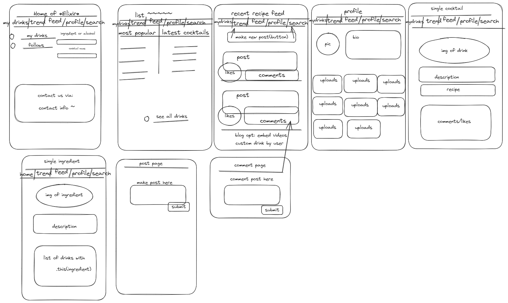

# Elixir

## Description
Elixir is a web app that provides an approachable entrance to creating mixed drinks and cocktails. Elixir also provides a platform to stay up to date with the latest and most innovative recipes that people are posting.
Users are calling it the `Twitter of Alcoholism`.
 a [Next.js](https://nextjs.org/) project bootstrapped with [`create-next-app`](https://github.com/vercel/next.js/tree/canary/packages/create-next-app).

### Features 
* Predictive search feature to allow ease of browsing 
* Instructional guide to creating mixed drinks and cocktails
* Communicative Platform to stay up to date with the latest and most innovative recipes
* Intuitive styling that allows consitent flow to navigating
* Built a cloud based API to allow responsive access to database both in development and deployment 
* Ability to share your own recipes
* Incorporated authorization to protect user data using JWT, Passport and bcrypt
* NextJs implementation to create a responsive web app


## Wireframes
### Initial Wireframes 


### Deployment

## Getting Started

### Frontend specific
* `Fork` and `Clone` this repository.
* Install the needed dependencies with `npm install`.
* Add a .env file globally and declare your `NEXT_PUBLIC_SERVER_URL` and it's value for the frontend.
* To access the web app, `npm run dev` in your terminal, then open [http://localhost:3000](http://localhost:3000) in your browser.
* Explore the App in your browser. 

### Backend specific
* `Fork` and `Clone` the [Elixir-backend](https://github.com/darkartaudio/elixir-backend) repository.
* Install the needed dependencies with `npm install`.
* Add a .env file globally and declare your `MONGO_URI` and `JWT_SECRET` values for the backend.
* To start the backend server, `npm run dev` in your terminal.


## File Structure 
Elixir was built on the NextJs framework while implementing express, MongoDB, Mongoose, Javascript and Bulma's CSS library. 
The backend involved implemented CRUD operations when creating our API and routing for our frontend logic. 
Tests were created to allow for scalability and future enhancements.
- See `test` folder on the backend.

### Backend structure
Our API incorporates referencing instead of embedded documents to demonstrate associations. This allowed for future scalability and reduced possible redundancy in the code.
We also seeded our database wiht information from the [Cocktail-DB](https://www.thecocktaildb.com/api.php). For our needs we had to seed our database asynchronously to avoid API throttling when accessing the `Cocktail API`. This would have became a concern on the front end and our time cost would have increased. 

```javascript
axios.get(`${process.env.API}/filter.php?a=Alcoholic`)
.then(response => {
    let drinkIds = [];
    let drinks = response.data.drinks;
    let numDrinks = drinks.length;
    for (let i = 0; i < numDrinks; i++) {
        drinkIds.push(drinks[i].idDrink);
    }

    // Get list of all non-alcoholic drink IDs from API
    axios.get(`${process.env.API}/filter.php?a=Non_Alcoholic`)
    .then(async response => {
        let drinks = response.data.drinks;
        let numDrinks = drinks.length;
        for (let i = 0; i < numDrinks; i++) {
            drinkIds.push(drinks[i].idDrink);
        }
        for (let i = 0; i < drinkIds.length; i++) {
            axios.get(`${process.env.API}/lookup.php?i=${drinkIds[i]}`)
            .then(response => {
                let drink = response.data.drinks[0];
                let newDrink = {...}
                Recipe.create(newDrink)
                .then(async createdDrink => {     
                    for (let i = 1; i <= 15; i++) {
                        let ingredient = drink[`strIngredient${i}`];
                        if (ingredient) {                           
                            await Ingredient.findOne({ name: firstLettersCapitalized(drink[`strIngredient${i}`])})
                            .then(ingredient => {
                                createdDrink.ingredients.push(ingredient);
                                createdDrink.measures.push(drink[`strMeasure${i}`]);
                            })
                            .catch(err => console.log(err.message));
                        }}
                    createdDrink.save()
                    .then(savedDrink => console.log(savedDrink.name))
                    .catch(err => console.log(err.message));
                })})
            .catch(err => console.log(err.message));
            // Wait half a second to avoid API throttling
            await wait(500);
        }
    })
    .catch(err => console.log(err.message));
})
.catch(err => console.log(err.message));

```

Our recipe schema demonstrates the associations between models
```javascript
const recipeSchema = new mongoose.Schema({
    name: {type: String, required: true},
    ingredients: [{ type: mongoose.Schema.Types.ObjectId, ref: 'Ingredient' }],
    measures: [String],
    instructions: String,
    alcoholic: {type: Boolean, required: true},
    image: String,
    createdBy: [{ type: mongoose.Schema.Types.ObjectId, ref: 'User' }],
    glassType: String,
    category: String,
    favoriteCount: { type: Number, default: 0 },
    comments: [{ type: mongoose.Schema.Types.ObjectId, ref: 'Comment' }],
},{ timestamps:true })

const Recipe = mongoose.model('Recipe', recipeSchema);
```
We presented a trending board that began on the backend. This allowed us to send our recipes to the front end based on the amount of times they have been favorited. Specifically we chose to send the only the ingredients and creator of the recipe to boost processing speeds.

```javascript
router.get('/trending/:num', (req, res) => {
    Recipe.find({})
    .sort({ favoriteCount: -1 })
    .limit(parseInt(req.params.num))
    .populate('ingredients createdBy')
    .then((recipes) => {
        return res.json({ recipes: recipes });
    })
    .catch(error => {
        console.log('error', error);
        return res.json({ message: 'There was an issue please try again...'});
    });
});
```

### Frontend structure 
On the front end we presented our unique styling and layout built using Bulma. Our home page demonstrated our created scroll tile as well as our predictive search feature. 
```jsx
 const renderScrollTile = () => {
        if(recipes) {
            const recipeTiles = recipes.map((recipe, i) => (
                <RecipePreviewContainer key={recipe._id} recipe={recipe} />
            ));
            const rows = [];
            for (let i = 0; i < recipeTiles.length; i += 2) {
                rows.push(
                    <div className='tile is-parent'>
                        {recipeTiles[i]}
                        {i + 1 < recipeTiles.length ? recipeTiles[i + 1] : null}
                    </div>
                )
            }
            return rows;
        }
    }
```

Our predictive search allows the ability to search for a user, recipe, or recipe using specific selected ingredients. This feature has also been implemented when a user wants to share their own recipe. This allows for ease of recipe creation and promotes sharing a user sharing their creation. 
```jsx
export default function Search() {
    const paramStyle = {
        color: 'green'
    }
...
    const updateIngredientOptions = useCallback((newQuery) => {
        if(newQuery) {
            if(ingredientsLoading) {
                return setIngredientsList(['Loading...']);
            }
            const results = ingredients.filter(ingredient => {
                if (newQuery === '') return true;

                let isAlreadySelected = false;
                selectedParams.forEach(param => {
                    if (ingredient._id === param._id) isAlreadySelected = true;
                });
                if (isAlreadySelected) return false;
                
                return ingredient.name.toLowerCase().includes(newQuery.toLowerCase());
            });

            setIngredientsList(results);
        }
    }, [ingredients, selectedParams, ingredientsLoading]);

    const updateRecipeOptions ...

    const updateUserOptions ...
    
    const handleChange = (e) => {
        const newQuery = e.target.value;
        setQuery(newQuery);
        updateIngredientOptions(newQuery);
        updateRecipeOptions(newQuery);
        updateUserOptions(newQuery);
    }

    const addParam = (ingredient) => {
        let newParams = [...selectedParams];
        newParams.push(ingredient);
        setSelectedParams(newParams);
        updateIngredientOptions();
    }

    const removeParam = (ingredient) => { ... }

    useEffect(() => { ... }, [router, searchResults, searchRedirect, recipeRedirect, userRedirect]);
    
    useEffect(() => {
        fetch(`${process.env.NEXT_PUBLIC_SERVER_URL}/ingredients`)
        .then((res) => res.json())
        .then((result) => {
            setIngredients(result.ingredients);
            setIngredientsLoading(false);
        });
    }, []);


    useEffect(() => {
        updateIngredientOptions(query);
        updateRecipeOptions(query);
        updateUserOptions(query);
    }, [selectedParams, query, updateIngredientOptions, updateRecipeOptions, updateUserOptions]);
    
    return (
        <>
            <div>
                <form onSubmit={handleSubmit}>
                    <input type="search" value={query} onChange={handleChange} />
                    <button type="submit">Search</button>
                </form>
                <ul style={paramStyle}>
                    {(selectedParams === '' ? '' : selectedParams.map(param => {
                        return <li key={param._id}>{param.name} <a onClick={() => {
                            removeParam(param);
                            updateIngredientOptions();
                        }}>X</a></li>
                    }))}
                </ul>
                ...
            </div>
        </>
    );
}
```

## Deployed on Heroku

# Future Enhancements

## Contributing 
Pull requests are welcome. For major changes, please open an issue first to discuss the potential implementations.


