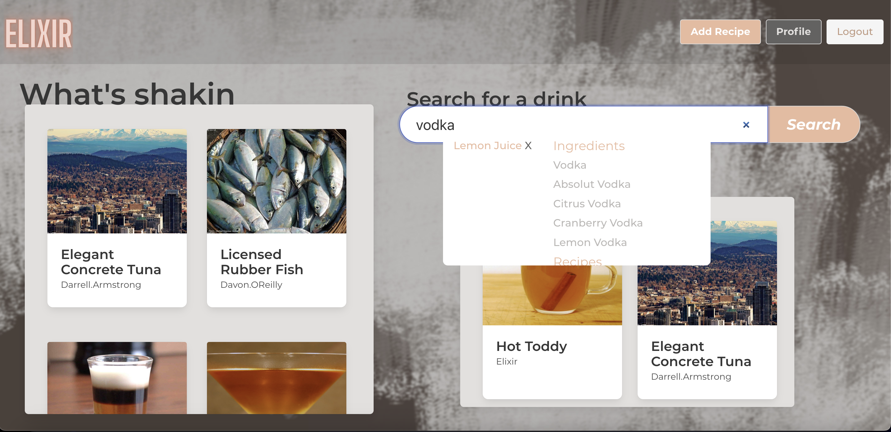

## "The Twitter of Alcoholism"

Elixir is a place for mixologists to mix together. It's designed to provide an approachable place for people to share, whether it's a new spin on their favorite cocktail or the story of why they'll never take another sip of tequila. 


 Stay up to date with the latest and most innovative recipes posted by mixologists on Elixir. 

To use online, visit: https://twitter-of-alcoholism.netlify.app/

### Features 
* A comprehensive database of alcoholic and non-alcoholic cocktails 
* Predictive search features that allow users to quickly find drinks of their choice or a discover new favorite. 
* Detailed descriptions of drinks, their ingredients and accurate measurements. 
* Communicative platform to stay up to date with the hottest (or coldest) beverages
* Ability to share custom recipes and receive community feedback
* Discover the most liked recipes on the platform 
* Save drinks you want to try to make yourself for later

***

## Installation

### Prerequisites
* Node.js
* MongoDB database - local install or [Mongo Atlas](http://mongodb.com/atlas)
* [The Cocktail DB API Key](https://www.thecocktaildb.com/api.php)

### Backend
* `fork` and `clone` the [Elixir-backend](https://github.com/darkartaudio/elixir-backend) repository.
* Install the needed dependencies with `npm install`.
* Create a .env file in the repository root and add the following environment variables:
    * `MONGO_URI=insert-your-database-uri-here`
    * `API=http://www.thecocktaildb.com/api/json/v2/your-api-key`
    * `JWT_SECRET=secret-key-of-your-choice`
* Add a .env file globally and declare your `MONGO_URI` and `JWT_SECRET` values for the backend.
* Run `npm run dev` in a terminal.

### Database seeding
* Using the command `node seeders/file-name`, seed in this order:
    * `ingredients.js`
    * `recipes.js`
    * `users.js` (optional)
    * `custom-recipes.js` (optional)
    * `comments.js` (optional)
    * `favorites.js` (optional)

### Frontend
* `fork` and `clone` this repository.
* Install the needed dependencies with `npm install`.
* Create a .env file in the repository root and add the following environment variable:
    * `NEXT_PUBLIC_SERVER_URL=http://localhost:8000`
* Run `npm run dev` in a terminal.
* Open [http://localhost:3000](http://localhost:3000) in a web browser.

***

## File Structure

### Tech Stack
Elixir is built on a MERN ([MongoDB](https://www.mongodb.com/), [Express](https://expressjs.com/), [React](https://react.dev/), [Node](https://nodejs.org/)) stack, with [Next.js](https://nextjs.org/) and [Bulma](https://bulma.io/).

### API
Elixir-backend implements CRUD operations, bridging the gaps between The Cocktail DB API, our database, and the frontend. 
* Routes were tested using [Mocha](https://mochajs.org/)

### Database
Due to our data's highly-relational nature, our MongoDB database implements associations via document referencing rather than embedded documents.

### Styling
We leveraged the Bulma CSS library for responsive styling

***
## Screenshots

### Home / Search


### Single Recipe


### Comments


### Profile


***

## Code Snippets

### Seeding
Seeding our database with ingredient and recipe information from The Cocktail DB required pacing of API calls to avoid throttling.

```javascript
function wait(time) {
    return new Promise(resolve => {
        setTimeout(resolve, time);
    });
}
```

```javascript
// Get list of all alcoholic drink IDs from API 
axios.get(`${process.env.API}/filter.php?a=Alcoholic`)
...
axios.get(`${process.env.API}/filter.php?a=Non_Alcoholic`)
...
.then(async response => {
    let drinks = response.data.drinks;
    let numDrinks = drinks.length;
    for (let i = 0; i < numDrinks; i++) {
        drinkIds.push(drinks[i].idDrink);
    }
    for (let i = 0; i < drinkIds.length; i++) {
        axios.get(`${process.env.API}/lookup.php?i=${drinkIds[i]}`)
        .then(response => {
            let drink = response.data.drinks[0];
            let newDrink = {...}
            Recipe.create(newDrink)
            .then(async createdDrink => {     
                for (let i = 1; i <= 15; i++) {
                    let ingredient = drink[`strIngredient${i}`];
                    if (ingredient) {                           
                        await Ingredient.findOne({ name: firstLettersCapitalized(drink[`strIngredient${i}`])})
                        .then(ingredient => {
                            createdDrink.ingredients.push(ingredient);
                            createdDrink.measures.push(drink[`strMeasure${i}`]);
                        })
                        .catch(err => console.log(err.message));
                    }}
                createdDrink.save()
                .then(savedDrink => console.log(savedDrink.name))
                .catch(err => console.log(err.message));
            })})
        .catch(err => console.log(err.message));
        // Wait half a second to avoid API throttling
        await wait(500);
    }
})
```
### Database Configuration
Our recipe schema demonstrates the associations between models.
```javascript
const recipeSchema = new mongoose.Schema({
    name: {type: String, required: true},
    ingredients: [{ type: mongoose.Schema.Types.ObjectId, ref: 'Ingredient' }],
    measures: [String],
    instructions: String,
    alcoholic: {type: Boolean, required: true},
    image: String,
    createdBy: [{ type: mongoose.Schema.Types.ObjectId, ref: 'User' }],
    glassType: String,
    category: String,
    favoriteCount: { type: Number, default: 0 },
    comments: [{ type: mongoose.Schema.Types.ObjectId, ref: 'Comment' }],
},{ timestamps:true })

const Recipe = mongoose.model('Recipe', recipeSchema);
```

### Scroll Tile 
The `recipeScrollTile` component is a reusable widget used to display different collections of recipes in different parts of the app.
```jsx
 const renderScrollTile = () => {
        if(recipes) {
            const recipeTiles = recipes.map((recipe, i) => (
                <RecipePreviewContainer key={recipe._id} recipe={recipe} />
            ));
            const rows = [];
            for (let i = 0; i < recipeTiles.length; i += 2) {
                rows.push(
                    <div className='tile is-parent'>
                        {recipeTiles[i]}
                        {i + 1 < recipeTiles.length ? recipeTiles[i + 1] : null}
                    </div>
                )
            }
            return rows;
        }
    }
```

### Search Bar

Our predictive search allows the user to search for a drink recipe by name, or for all recipes matching a list of ingredients. 

```jsx
export default function Search() {
...
    const updateIngredientOptions = useCallback((newQuery) => {
        if(newQuery) {
            if(ingredientsLoading) {
                return setIngredientsList(['Loading...']);
            }
            const results = ingredients.filter(ingredient => {
                if (newQuery === '') return true;

                let isAlreadySelected = false;
                selectedParams.forEach(param => {
                    if (ingredient._id === param._id) isAlreadySelected = true;
                });
                if (isAlreadySelected) return false;
                
                return ingredient.name.toLowerCase().includes(newQuery.toLowerCase());
            });
            setIngredientsList(results);
        }
    }, [ingredients, selectedParams, ingredientsLoading]);
    
    const handleChange = (e) => {
        const newQuery = e.target.value;
        setQuery(newQuery);
        updateIngredientOptions(newQuery);
        updateRecipeOptions(newQuery);
        updateUserOptions(newQuery);
    }

    const addParam = (ingredient) => {
        let newParams = [...selectedParams];
        newParams.push(ingredient);
        setSelectedParams(newParams);
        updateIngredientOptions();
    }

    const removeParam = (ingredient) => { ... }


    useEffect(() => {
        updateIngredientOptions(query);
        updateRecipeOptions(query);
        updateUserOptions(query);
    }, [selectedParams, query, updateIngredientOptions, updateRecipeOptions, updateUserOptions]);
    
    return (
        <>
            <div>
                <form onSubmit={handleSubmit}>
                    <input type="search" value={query} onChange={handleChange} />
                    <button type="submit">Search</button>
                </form>
                <ul style={paramStyle}>
                    {(selectedParams === '' ? '' : selectedParams.map(param => {
                        return <li key={param._id}>{param.name} <a onClick={() => {
                            removeParam(param);
                            updateIngredientOptions();
                        }}>X</a></li>
                    }))}
                </ul>
                ...
            </div>
        </>
    );
}
```

## Wireframes


## Deployed on Heroku and Netlify
[](link here)

# Future Enhancements
* Incorporate ability to follow other users
* Direct messaging system
* Allow users to create custom ingredients
* Implement single ingredient route with connectivity to recipes incorporating ingredient
* Incorporate AI based on user interaction to improve user experience 

## Contributing 
Pull requests are welcome. For major changes, please open an issue first to discuss the potential implementations.

## Attribution
Built using [The Cocktail DB](https://www.thecocktaildb.com/api.php).

[](https://opensource.org/licenses/MIT)